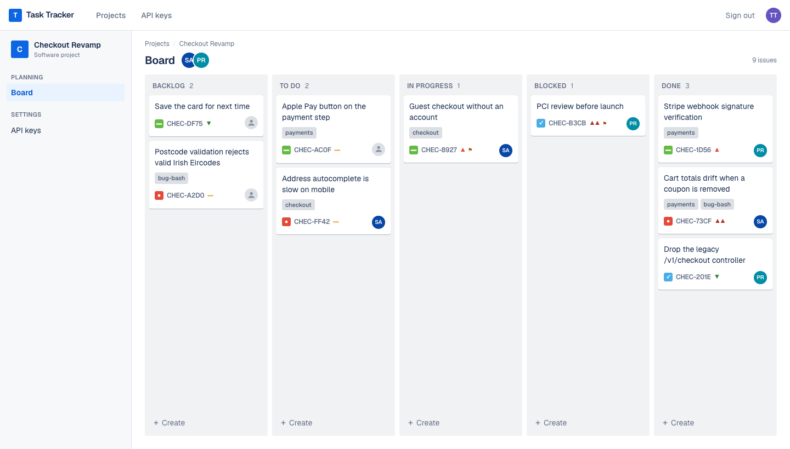
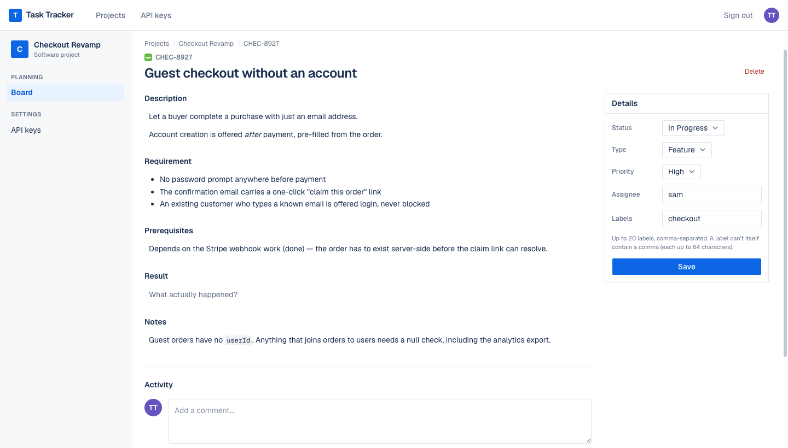
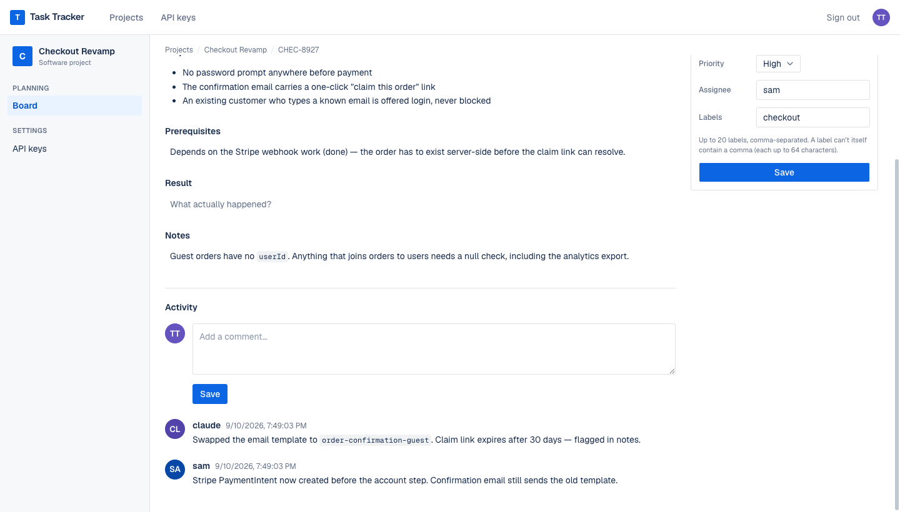
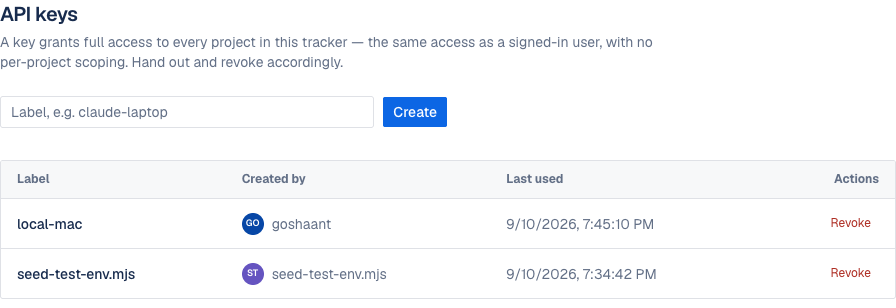

# Task Tracker

**A kanban board humans drag and agents read.** One source of truth, so neither
goes stale.

Markdown task files rot the moment two people touch them. This is the same
information behind a board you can work in the browser and a REST API an agent
can query — the same data layer, the same validation, the same code path. A
card you drag and a `PATCH` from Claude land in exactly the same place.

<p align="center">
  
</p>

<p align="center">
  <sub>Next.js 16 · Appwrite · TypeScript · Tailwind 4 · shadcn/ui</sub>
</p>

---

## Why it exists

An agent working a long task needs three things a chat window can't give it:
what it is supposed to build, what it already tried, and what it must not
break. Every task here carries five markdown fields for exactly that:

| Field | Answers |
|---|---|
| `description` | What is this? |
| `requirement` | What does done look like? |
| `prerequisites` | What must be true before starting? |
| `result` | What actually happened? |
| `notes` | **What to keep in mind while working on something else** |

`notes` is the one that earns its keep. A caveat discovered on one task — *"the
orders table has no cascade, delete children first"* — is surfaced on **every**
board read, so it reaches whoever is working the *next* task instead of dying
with the ticket it was learned on.

## The issue view

Five markdown fields on the left, the scalars on the right, and a shared work
log at the bottom. Both doors write to it, so a human scrolling the activity
sees the agent's progress in the same stream as their colleague's.

<p align="center">
  
</p>

<p align="center">
  
</p>

Every markdown field is click-to-edit and saves on blur. Rendering goes through
`react-markdown` with `remark-gfm` and **deliberately no `rehype-raw`** — raw
HTML in a task body is inert text, and nothing in this app ever calls
`dangerouslySetInnerHTML`.

---

## Install

**You need:** Node 20 or newer, and an Appwrite server — self-hosted or
[Appwrite Cloud](https://cloud.appwrite.io). Developed against Appwrite 1.9.0.

### 1. Clone and install

```bash
git clone https://github.com/goshantmeher/tasktracker.git
cd tasktracker
npm install
```

### 2. Set up Appwrite

In the Appwrite console:

1. **Create a project.** Copy its ID from *Settings → Project ID*.
2. **Create a database.** *Databases → Create database*. Copy its **ID**, not
   its name. `npm run setup` creates the collections *inside* this database
   but does not create the database itself — this is the step people miss.
3. **Create an API key.** *Overview → Integrations → API keys → Create*, with
   scopes `databases.*`, `collections.*`, `attributes.*`, `indexes.*`,
   `documents.*` and `users.read`. Copy it now; Appwrite shows it once.
4. **Create your user.** *Auth → Create user*, with an email and password.
   There is no signup page in this app, by design.

### 3. Configure

```bash
cp .env.example .env.local
```

Fill in the four `APPWRITE_*` values from the step above. `.env.local` is
gitignored and must stay that way — every value in it is server-side only, and
there is deliberately no `NEXT_PUBLIC_APPWRITE_*` variable anywhere, so no
Appwrite credential ever reaches the browser.

### 4. Create the schema

```bash
npm run setup
```

Creates four collections — `projects`, `tasks`, `worklog`, `api_keys` — with
their attributes and indexes. Idempotent: it prints `exists` for anything
already there, so it is safe to re-run after an interrupted setup or an
Appwrite upgrade.

### 5. Run it

```bash
npm run dev
```

Open <http://localhost:3000>, log in with the user you created, and make your
first project. Then mint a key at `/settings/keys` to
[connect an agent](#giving-an-agent-access).

### Deploying

It is a stock Next.js app — anything that runs `next build` works. This one
runs on [Coolify](https://coolify.io) pointed at the GitHub repo, which
redeploys on push to `main`. Set the same four `APPWRITE_*` variables in the
host's environment settings; there is no build-time secret, so a container
image is safe to rebuild anywhere.

> **If your deployment returns `503 no available server`:** check that the
> domain is stored with an `https://` scheme, not `http://`. Coolify generates
> its Traefik router from that scheme, so an `http://` FQDN produces only an
> HTTP router and every HTTPS request falls through to the catch-all — which
> has no backend. Cost us an afternoon.

## Giving an agent access

Mint a key at `/settings/keys`. The plaintext is shown **once**; only its
SHA-256 hash is stored, so a leaked database yields nothing usable.

<p align="center">
  
</p>

A key grants full access to every project — the same access a signed-in user
has, with no per-project scoping. That is a deliberate choice, not an
oversight: authentication *is* the authorization boundary here. Hand keys out
and revoke them accordingly.

### As an MCP server (recommended)

The tracker speaks MCP over HTTP, so an agent gets the board as *tools*
rather than a curl cheatsheet. From any repo:

```bash
claude mcp add --transport http tasktracker \
  https://<your-host>/api/mcp --header "x-api-key: $TASKTRACKER_KEY"
```

That's it — no checkout of this repo, no local process. Seven tools:

| Tool | Does |
|---|---|
| `get_board` | The whole board as markdown. Start here. |
| `list_projects` | Every project and its slug |
| `list_tasks` | One board, filtered by status / type / assignee / label |
| `get_task` | One task with all five fields and its full log |
| `create_task` | Add a task to the bottom of a column |
| `update_task` | Partial update — omitted fields are left alone |
| `add_log` | Append to the work log |

There is deliberately no `delete_task`: deleting is irreversible, takes the
work log with it, and is the one operation a human should have to click.
The REST door still has `DELETE` for scripts that genuinely need it.

The server is stateless — no session is issued, so it runs on however many
instances the deployment has — and it authenticates with the same
`x-api-key` every other route takes. MCP gets no door of its own.

### Or over plain HTTP

At the start of a session:

```bash
curl -s -H "x-api-key: $TASKTRACKER_KEY" \
  "$TASKTRACKER_URL/api/context?project=<slug>"
```

That returns the whole board as markdown: caveats first, then open tasks with
their descriptions, requirements and recent work log, then finished work. One
call, whole picture.

Write progress back:

```bash
# Move a task and record what happened
curl -X PATCH -H "x-api-key: $KEY" -H 'content-type: application/json' \
  -d '{"status":"in_progress"}' "$URL/api/tasks/<id>"

curl -X POST -H "x-api-key: $KEY" -H 'content-type: application/json' \
  -d '{"body":"Tried the migration, hit a FK constraint on orders."}' \
  "$URL/api/tasks/<id>/log"

# Flag something everyone should remember, including on other tasks
curl -X PATCH -H "x-api-key: $KEY" -H 'content-type: application/json' \
  -d '{"notes":"The orders table has no cascade. Delete children first."}' \
  "$URL/api/tasks/<id>"
```

`PATCH` is partial — send only the fields you are changing. Fields you omit are
left alone, so writing `result` cannot clobber a `requirement`.

## Endpoints

| Method | Path | Purpose |
|---|---|---|
| GET | `/api/context?project=<slug>` | Whole board as markdown. Start here. |
| GET | `/api/projects` | List projects |
| GET | `/api/tasks?project=<slug>` | Filter by `status`, `type`, `assignee`, `label`, `limit` |
| POST | `/api/tasks` | Create. `project` and `title` required |
| GET/PATCH/DELETE | `/api/tasks/<id>` | Read, partially update, or delete (also clears its log) |
| GET/POST | `/api/tasks/<id>/log` | Read or append work log |
| POST | `/api/mcp` | MCP over streamable HTTP (see above) |
| POST | `/api/login` | Exchange email/password for a session cookie |

Every route above except `/api/login` requires a caller: either an `x-api-key`
header or the browser's session cookie — both resolve through the same
`resolveCaller()` and land on the same data layer, so a human dragging a card
and an agent PATCHing the same task hit identical code.

`POST /api/login` is how a non-browser client (curl, a script, an agent) gets
that session cookie — the browser's own login form is a Server Action, which
nothing outside a browser can invoke. It is unauthenticated and
internet-reachable by design, with no bespoke rate limiting here: that is the
same exposure the browser login form already has, and Appwrite rate-limits its
own auth endpoint. Most agents should use an API key instead; this endpoint
exists for parity, not as the recommended path.

## How it's built

**SSR-first, no credentials in the browser.** Only the `node-appwrite` server
SDK is used, and it is importable from exactly three modules (`lib/appwrite.ts`,
`lib/db.ts`, `lib/auth.ts`). There is no `NEXT_PUBLIC_APPWRITE_*` variable
anywhere, by design. The Appwrite session secret lives in the app's own
httpOnly, `sameSite=lax` cookie, set in one place.

**One place talks to Appwrite.** `lib/db.ts` is the only module that touches
the Databases API. Pages, Server Actions and REST routes all call functions
from it, so there is no per-endpoint boilerplate and no second implementation
of a query to drift out of sync.

**Card order is a float.** Dropping a card between two others assigns the
midpoint of their orders — no reindexing pass, no write amplification, one
`PATCH` per drop.

**Polling, not realtime.** The board refreshes on focus, on tab visibility, and
every 10s while visible. A websocket would be a second connection and a second
failure mode to buy a few seconds of latency on a board a handful of people
watch.

## Tests

```bash
npm test
```

Runs `node --test` over the pure-function unit tests in `test/*.test.mjs` and
`test/*.test.mts` (37 tests, no framework — `node:test` and `node:assert`
only), then the HTTP contract test (`test/api-contract.mjs`, 38 checks) against
a running dev server — so start `npm run dev` in another terminal first.

Needs `TEST_API_KEY`, `TEST_EMAIL` and `TEST_PASSWORD` in `.env.local`. If
either of the latter two is missing, the contract test's cross-door checks
(cookie login vs. API key, proving both land in the same place) are skipped —
which means the single most important property in this system goes unverified.
Fill them in rather than ignoring the skip.

## Deliberately not built

Realtime, comments, due dates, sprints, notifications, attachments,
configurable columns, roles, per-project permissions, and rate limiting on
`/api/login`. Reasoning in
`docs/superpowers/specs/2026-09-10-tasktracker-design.md`.

## License

MIT — see [LICENSE](LICENSE).
